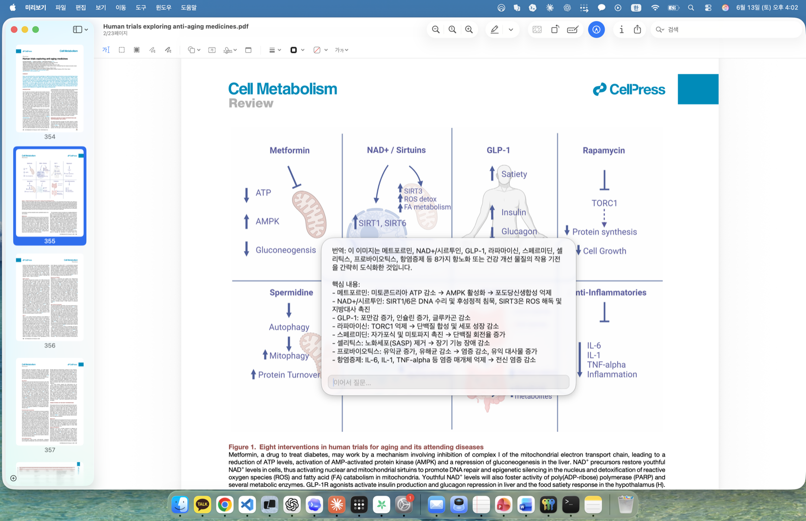

<div align="center">


# Macsist

**A native macOS menu-bar assistant that explains anything you select — instantly, locally, in your language.**

Press a hotkey → get a concise, streamed explanation of the **selected text** (in any app) or a **screen region** you drag-select, in a floating glass panel right by your cursor. Powered by a **local** MLX model — or any OpenAI-compatible API. No cloud required, no Electron.


<b>English</b> · <a href="README.ko.md">한국어</a> · <a href="README.zh.md">简体中文</a> · <a href="README.ja.md">日本語</a> · <a href="README.fr.md">Français</a> · <a href="README.de.md">Deutsch</a>

</div>

---

## ✨ What it does

Select some text — a foreign sentence, a dense paragraph, an error message, a snippet of code — press `⌘⇧E`, and Macsist streams a short explanation into a small panel next to your cursor. No window switching, no copy-paste into a chat app. It never steals focus from whatever you're working in.

- **📝 Explain text** — `⌘⇧E` reads your selection through Accessibility (with a clipboard-safe synthetic ⌘C fallback — your clipboard is always restored).
- **🖼 Explain a region** — `⌘⇧R` gives you a crosshair like ⌘⇧4; the captured image goes to a local **vision** model (great for diagrams, tables, screenshots, anything you can't select).
- **💬 Follow-up chat** — after an answer, just type in the panel. **Enter** sends, **Shift+Enter** adds a newline; the composer grows as you type and the panel follows. Same conversation, same model — vision sessions keep the image in context.
- **🌍 6 languages** — 한국어 · English · 简体中文 · 日本語 · Français · Deutsch, for **both** the UI and the answers. Switch live in Settings; no restart. Input in another language gets a natural `Translation:` line first.
- **🪟 Liquid-Glass panel** — a translucent, rounded, auto-sizing panel that fades in by the cursor. **Drag it anywhere** by its background to move it out of the way.
- **🗂 History** — every explain is saved locally and searchable (`⌘⇧H`). Copy it, re-ask it with the current model (region rows re-send the saved screenshot), or delete a session — all from a chat-style window.
- **🔌 Your model, your choice** — run a **local** MLX server, or point Macsist at any **OpenAI-compatible API** (OpenRouter, etc.). API keys live in the macOS **Keychain**, never on disk.
- **🔒 Private by default** — local-first, no telemetry, no Electron. A real signed `.app` bundle: Dock, Cmd-Tab and the permission lists all show **Macsist** with its icon.

---

## 📸 In action

<div align="center">

**Explain selected text** — highlight a passage, press `⌘⇧E`, and a translation plus a concise explanation stream in right beside it.


**Explain a screen region** — drag-select a figure with `⌘⇧R` and Macsist unpacks the whole diagram.



</div>

---

## 🖥 Requirements

- **macOS 26.2+** on **Apple Silicon**
- For a local model: roughly **16 GB+** unified memory (the installer recommends a model sized to your RAM). On smaller machines, use an external OpenAI-compatible API instead — no local model needed.

---

## ⬇️ Download

**Just want the app?** Download the latest build:

### → [**Download Macsist.dmg**](https://github.com/junidude/macsist/releases/latest/download/Macsist.dmg)

The build is **self-signed** (not notarized), so the first time you open it macOS blocks it with *"Apple could not verify 'Macsist' is free of malware"* — this is expected, it is **not** malware. **Don't click _Move to Trash_:**

1. Drag **Macsist** into **Applications**, then click **Done** on the dialog.
2. Open **System Settings → Privacy & Security**, scroll down, and click **"Open Anyway"** next to the Macsist message — confirm, and it opens.
   *(Terminal alternative: `xattr -dr com.apple.quarantine /Applications/Macsist.app`)*

After that it opens normally on double-click. On first launch Macsist asks whether to use an external API or a local model.

---

## 🛠 Install from source

For the full local-model stack:

```bash
git clone https://github.com/junidude/macsist.git
cd macsist
./install.sh
```

One interactive session does everything, and it's **idempotent** — re-run any time; finished steps are skipped:

1. **Hardware check** → recommends a model sized to your RAM (Qwen 3.6 / Gemma 4 multimodal tiers, or an external API for small machines)
2. **Environment** → miniforge/conda env for the server
3. **Model download** (asks for an optional Hugging Face token for faster pulls)
4. **Background services** → server + app installed as launchd agents (always on at login, auto-restart on crash)
5. **`macsist` CLI** → installed on your `PATH`
6. **Permissions** → guides you through the macOS **Accessibility** and **Screen Recording** grants
7. **Smoke test** → a real explain round-trip to confirm it works

After granting permissions, restart the app: `macsist restart app`.

<details>
<summary><b>Manual / developer path</b> (what the installer automates)</summary>

```bash
server/download_models.sh   # one-time model download
server/deploy.sh            # install the server LaunchAgent
app/deploy.sh               # build + install the signed app bundle
app/run.sh                  # …or run the app in the foreground for development
```

`app/deploy.sh` builds a real signed bundle with py2app — it needs a framework
Python: `brew install python@3.13`. Full spec and architecture:
[docs/SPEC.md](docs/SPEC.md).
</details>

---

## 🚀 Usage

| Hotkey | Action |
| --- | --- |
| `⌘⇧E` | Explain the selected text |
| `⌘⇧R` | Drag-select a screen region and explain it |
| `⌘⇧H` | Open the History / Settings window |
| `Enter` | Send a follow-up question |
| `Shift+Enter` | New line in the follow-up box |
| `Esc` | Clear the input, then dismiss the panel |

All hotkeys are rebindable in **Settings → Hotkeys**. The result panel never activates the app, so your current window keeps focus the whole time.

---

## 🎛 Configuration

Open **Settings** from the menu-bar icon (or `macsist settings`):

- **General** — UI + answer **language** (applies instantly on save).
- **Connection** — pick the active **provider** (local server or an external OpenAI-compatible endpoint), set its URL, models, and API key. Keys are stored in the **Keychain**. Switch providers without restarting.
- **Response** — **detail level**: Brief · Normal · Detailed (controls length and depth).
- **Hotkeys** — record new shortcuts (matched by physical key, so they work under any keyboard layout).
- **Appearance** — panel size, font size, and glass style.
- **Advanced** — system prompts (text & image), temperature, max tokens, follow-up depth, and a restore-to-defaults button.

---

## 🧰 `macsist` CLI

Installed by `install.sh` as a symlink on your `PATH` — works from any directory.

| Command | Does |
| --- | --- |
| `macsist` | ensure both agents are running, then print a status summary |
| `macsist start\|stop\|restart [app\|server]` | manage the launchd agents |
| `macsist status` | agents, server health, provider/models, TCC state |
| `macsist logs [app\|server] [-f]` | tail the right log files |
| `macsist settings` / `macsist history` | open the main window |
| `macsist doctor` | full ✓/✗ diagnosis: deploy, config, Keychain key, health, TCC, model cache |
| `macsist update` | `git pull --ff-only` + redeploy both agents |

---

## 🏗 How it works

The app is a **thin HTTP client**. It talks to an OpenAI-compatible LLM server at `http://127.0.0.1:8000` — a small FastAPI proxy that routes to the right MLX backend:

```
app ──► :8000  proxy (FastAPI)
                 ├─ dense text model      ─► :8002  mlx-lm
                 └─ multimodal (text+img) ─► :8001  mlx-vlm
```

The proxy streams tokens (SSE) straight through, so the app only ever talks to `:8000`; switching the `model` field transparently routes to the right backend. Both server and app run as **launchd agents** (always on at login, auto-restart on crash). Models are configurable, never hardcoded.

Logs:

```bash
tail -f ~/Library/Logs/Macsist/app.log        # the menu-bar app
tail -f ~/Library/Logs/llm-server/proxy.log   # the LLM proxy
```

Full architecture, milestones (M0–M12) and design notes: **[docs/SPEC.md](docs/SPEC.md)**.

---

## 🩺 Troubleshooting

- **`macsist doctor`** — one command that checks deploy, config, the Keychain key, server health, TCC permissions, and the model cache.
- **Hotkeys do nothing** → grant **Accessibility**, then `macsist restart app`.
- **Region capture fails** → grant **Screen Recording**, then `macsist restart app`.
- **Server unreachable** → `macsist status` / `macsist logs server -f`. First start loads the model into memory (~60–90 s).
- **Stream ends with no answer** → a thinking model may have used the whole token budget; raise **max tokens**, or check the model in Settings.

---

<div align="center">
<sub>Built with Python 3.13 + PyObjC (AppKit), <code>pynput</code>, <code>httpx</code> · MLX (<code>mlx-lm</code> / <code>mlx-vlm</code>) behind a FastAPI proxy · Apple Silicon, macOS 26.2+</sub>
</div>
